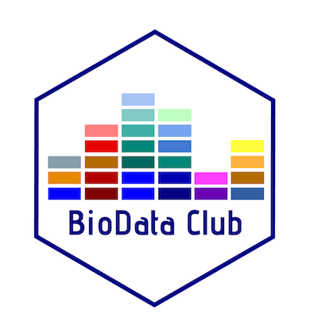

# BioData Club Kit



## 1. What's included in the kit

The BioData Club Kit contains a website template with starter content for getting a BioData Club started at your home institution. This site is designed to run on GitHub pages and can be up and running in seconds for your own GitHub Organization.

Additionally, it contains the following:

1. [Code of Conduct](https://github.com/BioDataClubKit/BioDataClubKit.github.io/blob/master/code_of_conduct.md) - a suggested code of conduct for your own BioData Club Organization. The key to interdisciplinary learning is learning in a psychologically safe environment, and we believe our Code of Conduct encourages inclusion of many different kinds of learners.
2. [Community Guide](https://github.com/BioDataClubKit/BioDataClubKit.github.io/blob/master/community-guide.md) - tips and tricks we've learned about building our own BioData Club Community
3. Surveys (to be added soon). These are surveys that help you understand the data science needs of your community, and pre and post workshop surveys to understand and improve your workshops.

# Starting Up Your Own BioData Club

## 1. Forking this Repo

To get started, fork this repository to your [GitHub Organization](https://help.github.com/articles/about-organizations/). Click the "Fork" button on the top right of the page to do so.

## 2. Enabling your repository to run on GitHub Pages

Now you need to change the repository name to [ORGNAME].github.io, where [ORGNAME] is the name of your new organization.

Once you're done with that, make sure that you have clicked on, click on "Settings" for your repository. Under "GitHub Pages", make sure that "Source" is "Master branch" and then click the "Save" button.

## 3. Changing Titles/Text

The site is designed to be very customizable in terms of text. You can edit the splash page (the main page of the website) by editing the `index.html` file in the root folder. For the main splash page, each of the sections has a "feature row". The text for each row is under the `excerpt` heading in the YAML front matter. For example, the `intro` row has the following YAML entry.

`title` and `excerpt` are the two main sections for changing the text. To add a line break for the text of a feature row, use `<br><br>` within the text. You can add link buttons by adding a `url`, a `btn_label` and a `btn_class` field.

```
intro:
  -  image_path: /assets/img/Hex-BDP-small.png
     alt: "BioData Club logo"
     title: "What is BioData Club?"
     excerpt: "BioData Club is an informal and interdisciplinary co-learning initiative. We come together to share skills, ask questions, and learn about data science skills and open research tools. The model brings together learners starting from scratch (write your first line of code!) data science experts, and everyone in between to gain new data skills, troubleshoot projects, practice teaching in an informal context, and connect with other data and open science enthusiasts. <br><br>
The BioData Club Kit will help you start your own co-learning community! In addition to a website template, we’ve included a few of our most successful lessons, advice and resources for building a local co-learning club (we’ve leveraged a lot of good work from other organizations), and surveys for understanding your community's needs and goals.<br><br>"
     url: http://github.com/biodataclubkit/biodataclubkit.github.io
     btn_label: Download the Kit
     btn_class: "btn--primary"
```

## 4. Adding Events

Events can be added by adding a file to the `_events` folder.

You can see an example event here with all of the YAML fields to fill: https://github.com/BioDataClubKit/BioDataClubKit.github.io/blob/master/_events/2020-01-01-this_is_your_first_event.md  

Make a copy of one of these events, and make sure that you change the date in the title. For example, to add an event for October 16, 2018, I'd copy the file and change the name to `2018-10-16-my-new-event.md`. 

Here's an example of an event file. Make sure the text is in the double quotes. Make sure the link is a URL.

```
---
title: "The Magic of Markdown"
date: 2018-10-05
time: "4:00 - 5:30 PM"
location: "Choose a location that facilitates discussion and co-learning.  This means thinking about not only the technology a space provides, but also the face-to-face interaction it will allow"
description: "Create a welcoming description of your event.  Include a description of the learning outcomes and any prework (such as software downloads) attendees should accomplish."
link: "post a link to the open learning materials"
---
```

## 5. Adding a Blog Post

Your website is also set up to publish blog entries. In your root folder, you’ll find folder named `_posts`. This is where you’ll put new blog posts. Open this folder and create a new file.

Each post you make should be in the form YEAR-MONTH-DAY-title.md, so for example, `2017-04-21-github-pages-tutorial.md`. You’ll also want this .yaml-like text near the top.

```
---
layout: post
title: Awesome Blog Post
excerpt: "Why you should read my website"
tags: [intro, beginner, jekyll, tutorial]
comments: true
category: blog
---

Text for your post goes here.
```

# Acknowledgements


This kit is a project of the [Center for Data to Health (CD2H)](https://ctsa.ncats.nih.gov/cd2h/cd2h-labs/). Website template is based on [minimal-mistakes](https://github.com/mmistakes/minimal-mistakes).

The BioData Club Logo was designed by Danielle Robinson. 

